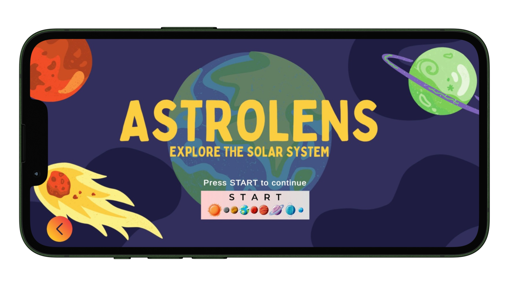
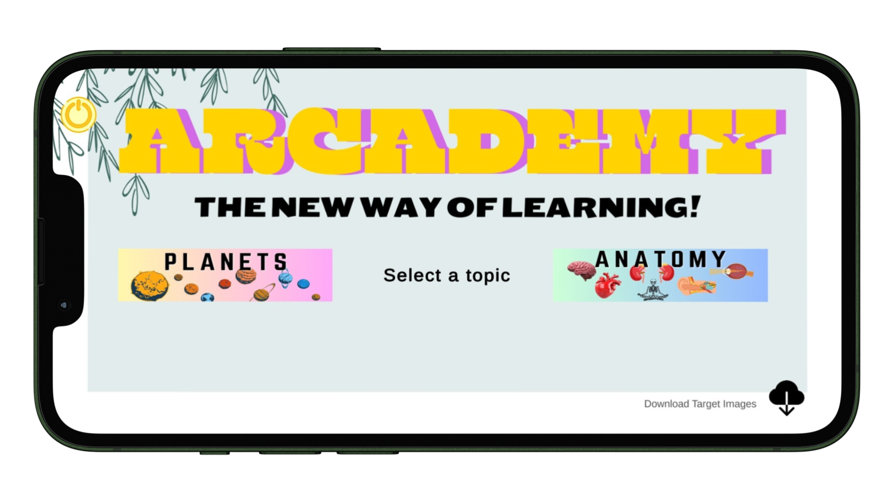
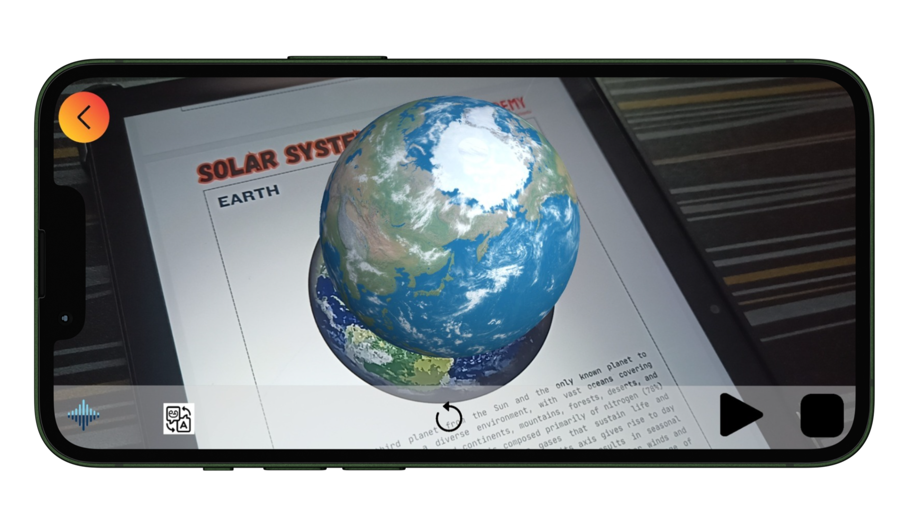

# ARcademy
ARcademy - An Augmented Reality based Encyclopaedia


ARcademy is a project aimed at creating an immersive augmented reality (AR) learning experience. It leverages cutting-edge technologies to enhance education through interactive AR simulations and visualizations.

## Preview








## Download Link

**Download the APK and target images**:
   [Download Here](https://drive.google.com/drive/folders/116VaV4-h73EPZVZWvmhcA5zXjQPrEssB).


## Features

- **Augmented Reality**: Utilizes AR technology to bring educational content to life.
- **Interactive Simulations**: Engaging simulations that help users grasp complex concepts.
- **Multi-platform Support**: Compatible with various AR-capable devices.
- **Open Source**: Contributions and feedback are welcome from the community.

## Technologies Used
- Unity 2022.3.20f1
- C# (Unity C#)
- Vuforia Engine

## Installation

To run ARcademy locally or contribute to its development, follow these steps:

1. **Clone the repository**:

   ```bash
   git clone https://github.com/ankithcrgowda/ARcademy.git
   cd ARcademy

2. **Set up dependencies**:

   Ensure you have the necessary dependencies installed. The dependencies includes:
   - **Unity 2022.3.20f1**
   - **C-Sharp**
   - **Vuforia Engine 10-24-4**

3. **Open the cloned project**:
   
   Open the cloned project in "Unity" Editor. The version used here is "2022.3.20f1". No need to download the exact version. you can download newer LTS version and can change the version of the project.

4. **Build and Run**:

   Follow instructions specific to your development environment to build and run ARcademy.

## License
This project is licensed under the MIT License.

## Show your Support🙏🏻

Give a ⭐ if you like this project.
Feedbacks are welcomed.

## You can also follow me on

<div margin-left="10px">
  <a href="https://www.linkedin.com/in/ankithcr" target="_blank">
    
  </a>
  <a href="https://www.github.com/ankithcrgowda" target="_blank">
    
  </a>
  <a href="https://www.instagram.com/_ankith.gowda" target="_blank">
    
  </a>
</div>
